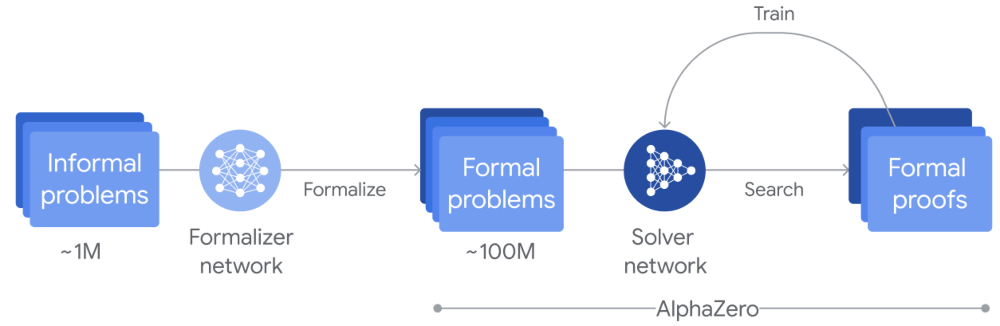
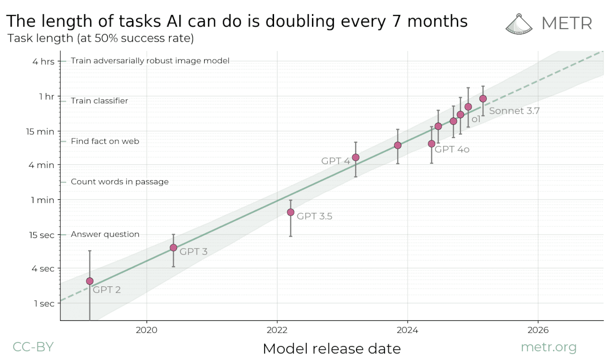

## What Just Happened?

OpenAI has reported that its latest experimental reasoning model achieved gold medal-level performance on the 2025 International Math Olympiad (IMO), solving 5 out of 6 problems under the same conditions as human participants (two 4.5‑hour sessions, no external tools).

<blockquote class="twitter-tweet">
1/N I’m excited to share that our latest <a href="https://twitter.com/OpenAI?ref_src=twsrc%5Etfw">@OpenAI</a> experimental reasoning LLM has achieved a longstanding grand challenge in AI: gold medal-level performance on the world’s most prestigious math competition—the International Math Olympiad (IMO). <a href="https://t.co/SG3k6EknaC">pic.twitter.com/SG3k6EknaC</a>
&mdash; Alexander Wei (@alexwei_) <a href="https://twitter.com/alexwei_/status/1946477742855532918?ref_src=twsrc%5Etfw">July 19, 2025</a></blockquote> 

They achieve this result using new general purpose reinforcement learning and test time compute scaling techniques.

## The New Research Technique

OpenAI claim to have developed new research technique allowing for general purpose RL and test time compute scaling.

My thoughts are they are likely to have achieved two significant breakthroughs:

1. RL on non-verifiable tasks, likely using some reasoning LLM-based reward model
2. Prevent exploding context lengths from test-time compute scaling using multi-agent learning

### RL on Non-Verifiable Tasks
They choose IMO as a benchmark because IMO proofs are hard to verify, unlike AIME with integer answers or Codeforces with programming test cases.
The IMO proofs generated by the model are natural language and cannot be easily verified, the proofs were graded by three former IMO medalists.

Reward models can be hacked, especially when LLMs tend to generate answers that seem correct but may contain subtle mistakes, so much of the recent gains in RL for LLMs have used verifiable rewards. OpenAI likely has used some reasoning LLM fine-tuned to be a reward model and red-teamed to avoid reward hacking.

For example, Bytedance's [Seed-Thinking-Verifier](https://arxiv.org/pdf/2504.13914) and [Kimi k1.5](https://arxiv.org/pdf/2501.12599) both use generative reward models with chain of thought before providing a reward as they tend to be more accurate. 

Using reasoning models allows for [chain-of-thought (CoT) monitoring](https://arxiv.org/pdf/2503.11926). Thus both the model generating the proof and the model verifying the proof can have their CoTs monitored for reward hacking. This is also an important direction for AI safety, [with many of the frontier AI labs advocating for CoT monitoring for AI safety and interperatiblity](https://arxiv.org/pdf/2507.11473).

### Multi-Agent Learning

#### Compressing Context Length
One issue from scaling up RL reasoning and leveraging test-time compute, is that models tend to reason for longer to solve harder tasks. LLMs perform worse with longer contexts and computation becomes more expensive, making it less compute-efficient.

One way to compress the context length is to incentivize reasoning with reduced tokens during the RL training process. This can be done by consolidating and pruning previous information such as in [MEM1](https://arxiv.org/html/2506.15841v1). Or the LLM can be directly incentivized to reduce tokens by applying a penalty for length in the RL reward.

It seems such context compression was used in the new reasoning model, with the proofs being generated using very concise English. In the IMO proofs, the model says things like: "need analyze n=3 precisely" and writes things like "done" and "good" when it finishes steps without using filler words.

This allows the model to reason more efficiently without effecting performance. However, a disadvantage of this approach is that the CoTs from the model become less interpretable. The model used is still a research model, and it is likely that the CoTs may be made more interpetable (either from rewriting the CoTs or by adding a RL alignment step which makes it more interpretable) before releasing to the public as a product.

#### Context Reduction with Multi-Agent Learning

Despite RL applied to reduce the length of context in reasoning, the context can still explode after prolonged reasoning, especially in hard tasks such IMO which may take hours to solve.

Instead, they likely introduce a multi-agent system where several LLMs reason in parallel and communicate key information between them such as successful steps or dead ends. These LLMs can then be trained via multi-agent RL to improve message passing and coordinate better, with different LLMs potentially specializing with different roles such as some LLMs verifying, other LLMs writing proofs, and others deciding when to stop reasoning on an approach or determining when an approach is promising.

It would be very exciting if this specialization emerges from multi-agent RL. That is, if the agent roles are not pre-defined by the programmer, but instead learned end-to-end via RL.

If this is the case, then we may soon see large groups of agents working together to solve increasingly hard tasks, with each agent keeping the others in check to reliably reason over a long context.

### OpenAI's Reasoning Model Progression

My guess is that OpenAI's o1 was the first attempt at incentivizing chain-of-thought reasoning through RL on **verifiable** rewards. o3 was the first **scaling** up of RL for reasoning. OpenAI's new experimental reasoning model uses RL on **non-verifiable** rewards, further scaling RL and improving reasoning on wide range of general tasks. The new multi-agent system for IMO is then **scaling reasoning to multi-hour time horizons** while maintaining solution diversity and test-time compute scaling effiency by preventing the context length from exploding.

The next step would be to scale up agents, scale up RL on non-verifiable rewards and add a learnable memory component where the model chooses which context to keep - further increasing the time in which the model can reason reliably. Also scaling up multimodal reasoning or ["thinking with images"](https://arxiv.org/abs/2506.23918) to reason better on problems with a visual component. My research explores this area with [Interactive Sketchpad](https://stevenshinechen.github.io/interactivesketchpad/) an LLM which draws images in its reasoning process to solve math problems and provide hints for students.

## Why this Matters

### General Purpose Reasoning with Natural Language

DeepSeek's [DeepSeek-Prover-V2](https://arxiv.org/pdf/2504.21801) and DeepMind's [AlphaProof](https://deepmind.google/discover/blog/ai-solves-imo-problems-at-silver-medal-level/) both combine LLMs with [Lean](https://lean-lang.org), a formal programming language used to verify mathematical proofs.
[AlphaGeometry 2](https://arxiv.org/pdf/2502.03544) uses a symbolic engine combined with LLMs to solve geometry problems.
Combining AlphaProof and AlphaGeometry 2 achieved silver medal-level performance in IMO 2024.

AlphaProof is trained by formalizing problems into Lean using a formalizer network, searching for proofs using a solver network (verified using Lean) and using the [AlphaZero](https://deepmind.google/discover/blog/alphazero-shedding-new-light-on-chess-shogi-and-go/?_gl=1*1rrdmid*_up*MQ..*_ga*ODIzMDU1OTMxLjE3NTI5Nzg4MDg.*_ga_LS8HVHCNQ0*czE3NTI5Nzg4MDgkbzEkZzAkdDE3NTI5Nzg4MDgkajYwJGwwJGgw) RL algorithm to solve progressively harder problems.

These are all neurosymbolic methods tailored specifically to solve mathematical problems. On the other hand, OpenAI's new experimental reasoning model does not have a symbolic component and uses general purpose reasoning, without being designed specifically to solve IMO problems. It also means a single model can solve all the problems without having to combine task specific models such as AlphaProof and AlphaGeometry 2.

This is exciting as it means the same system can be applied to a wide range of problems which can potentially solve real world problems and is a step towards AI contributing to scientific discoveries.

In my research on multimodal reasoning, I wanted to create a system that can achieve high accuracy in solving multimodal problems. My first thought was using a symbolic component (e.g. Lean) that ensures the final output is correct and easily verifiable. While being easily verifiable is a nice property, it constrains the types of problems you can solve (in this case, you can only solve math proofs).

Instead, I believe major progress in AI will not come from domain specific architectures, but from very simple, general frameworks that can be trained using RL and scaled up arbitrarily with search and learning as in the [Bitter Lesson](https://www.cs.utexas.edu/~eunsol/courses/data/bitter_lesson.pdf).

### New Frontier in Test Time Compute Scaling

The ability of models to reason effectively over very long time horizons (weeks/months) is essential to achieve significant scientific breakthroughs. 

METR posted an [article](https://metr.org/blog/2025-03-19-measuring-ai-ability-to-complete-long-tasks/#:~:text=If%20we%20plot%20this%20on,time%20of%20around%207%20months.)
which showed that the length of tasks AI agents can do is doubling every 7 months
.

OpenAI's new experimental reasoning model can reason for multiple hours which shows a continuation of this trend. The longer the models can reason for without breaking down, the harder and more useful real world tasks the model can solve. We introduced [PuzzleWorld](https://arxiv.org/pdf/2506.06211), a puzzlehunt benchmark aimed to test the ability of models to solve open-ended, multimodal problems that humans often take hours or even days to solve. OpenAI's new model shows a promising step in this direction of being able to solve longer time horizon problems.

### A New Paradigm of Multi-Agent Learning

Reasoning models such as OpenAI o3 can reason on the order of minutes.
However, computational cost scales quadratically with the context length and LLM performance tends to degrade on longer context lengths with high quality long context data for training models hard to come by.

A simple question to ask is that: is scaling test time compute on a single model the most compute-efficient, or are there alternatives?

Mixture of Experts (MoE) emerged as a more efficient architecture for LLMs with smaller expert modules being trained jointly with a router module which selects which experts to be activated for a specific task. This allows models with very large amount of parameters to be trained while reducing inference costs as only a fraction of the parameters is activated at inference time.

My speculation is that OpenAI have found similar test-time compute efficiency gain with multiple LLM agents. 

## Clues on how the system might work

Firstly, this breakthrough was from OpenAI's new multi-agent team (https://x.com/polynoamial/status/1946480714939085301). So it is likely that the system is composed of multiple agents. Also, the team has the right background for building such a multi-agent system, with Noam Brown and Alexander Wei (team lead) both being authors of the [CICERO](https://ai.meta.com/research/cicero/diplomacy/) paper - an AI which achieves human-level performance in the strategy game Diplomacy. CICERO is an AI agent which needs to communicate, negotiate and coordinate with other humans. They also have backgrounds in game theory which underpins many of the ideas in multi-agent learning.

(Fun fact: I attended a talk from Noam Brown at MIT in January 2025 where he was recruiting for the new multi-agent LLM team he was creating. I guess this is the first project that they worked on which they completed over the span of several months.)

Secondly, the team is small, (https://x.com/polynoamial/status/1946478258968531288) and fairly new, suggesting that a new model was not trained from scratch. Instead, it is likely that existing reasoning models were used (likely unreleased reasoning models) and RL post training techniques were applied.

Terence Tao hints how multiple agents may have been used and highlights how it is unfair to compare the performance of human participants with OpenAI's new AI model:
https://mathstodon.xyz/@tao/114881418225852441

He says that while the 6 human IMO participants in each team are not allowed to communicate and the team leader is not allowed to help them, if we change the format such that:
- (Hypothetically) Time passes more slowly for the student (parallel computation, inference time speed ups etc.)
- The leader rewrites the question into a format easier to work with (LLM question rewriting, subproblem decomposition etc.)
- The six students collaborating, communicating with each other on progress and dead ends (multiple LLM agents coordinating)
- Team leader guides the students towards promising approaches and stops them if they are stuck on an approach unlikely to succeed (Coordinator LLM that oversees the other agents)
- Team leader selects best solution, discarding the rest (Coordinator LLM selects best solution out of all the agents)
- If no student obtains a good solution, the team leader withdraws from the competition (Tuning the system to achieve strong performance on IMO 2025 without reporting poor results.)

## How it Works (Maybe)

Disclaimer: The following is speculation on how I think the system may have been built and is not necessarily the case - further research in this area is required to reproduce the results.

Drawing from the prior analysis, the following are my thoughts on how such a system could have been built, both from an engineering perspective and a multi-agent learning perspective.

### Engineering Perspective
Multiple strong baseline (unreleased) reasoning LLMs are used without limits on computational cost or inference.

A pool of 'Worker' LLMs are used to generate proofs. The workers in this pool can communicate with each other. To prevent the context length from blowing up, workers likely broadcast key pieces of information to a shared channel, accessible by all the LLMs in the pool.

In the context of math problems, the key pieces of information may be when the LLM gets stuck on an approach so decides to give up on it, telling other LLMs not to go down the same path, or if the LLM achieves some progress, showing the other LLMs what they have found.

A 'Coordinator' LLM is then used to manage the pool of workers. The coordinator acts as a general purpose neural verifier/reward model. It monitors the progress of all the LLMs. If an LLM is stuck on an approach, the coordinator may intervene to suggest ways to get unstuck, correct any mistakes, suggest to try a new approach or may kill the LLM altogether. If the LLM is killed, a new worker LLM may be spun up with the key pieces of information from the shared channel to start again. This allows reasoning to continuing for a prolonged amount of time. If a worker proposes multiple possible approaches, the coordinator may choose the one that it thinks is most promising in a deep learning guided search process. 

To maintain diversity of solutions, island-based evolutionary techniques could be used. For example, there could be multiple pools with limited information sharing between the pools to maintain diverse solutions. Or only the best, most diverse solutions could be kept in a manner similar to MAP-Elites.

My guess is that the 'new research technique' for this project is that they have found is a way to jointly train multiple LLMs agents with RL, extending the amount of time the LLMs can reason without degrading performance. It is likely that the RL on non-verifiable rewards probably was used to train the new experimental reasoning model that they used.

The worker and coordinator LLMs are jointly trained with multi-agent RL to get better at the above, for example, what pieces of information to pass in the shared channel, when the coordinator thinks a worker should stop or try a new direction etc.

From this, we can come up with new test-time compute scaling laws. For example, comparing the compute effiency for varying number of agents, varying number of pools etc.

### End-to-end Multi-Agent Learning Perspective

While the above is more of an engineering perspective of how such as system could be created. A very promising and exciting alternative could be that the LLM agents learn to specialize themselves via an end-to-end multi-agent RL training process.

A number of LLM agents can be trained via multi-agent RL to collaborate together and emergent abilities such as role specialization may emerge as the result of this process. 

If this approach is not already used in the system, it is likely that this approach would be their end goal as it is more bitter-lesson pilled than pre-defining the LLM agent system, allowing for scaling up of learning.

## Conclusion

OpenAI's gold medal performance at IMO 2025 marks a historic leap in the development of general-purpose AI reasoning systems. Unlike earlier neurosymbolic approaches that relied on hand-crafted formal tools such as Lean, OpenAI's latest reasoning model signals a paradigm shift to multi-agent reasoning systems with non-verifiable rewards, capable of operating over long time horizons with minimal task-specific engineering, only using natural language.

By demonstrating that a single system, built on general-purpose principles and trained with non-verifiable reward signals, can achieve strong performance on hard-to-verify tasks that take the smartest humans hours to solve, it underscores the viability of scaling intelligence not just by increasing pre-training compute or reasoning length, but by creating a simple agent-based system that can self-organize, specialize, and persist in solving complex problems over hours, perhaps soon even days or weeks.

This isn't just a win at a math competition. It is a signal that we are entering an era where AI can participate in open-ended scientific discovery, pushing the boundaries of what we consider solvable by AI. Problems that are easily verifiable and tractable (not NP-complete) will increasingly fall within reach. Even problems difficult to verify, yet can be tackled with deep learning guided verification and intuition may soon be within reach too.

Despite this progress, a fundamental tension still arises: while models scaled with sufficient compute have dramatically improved, true intelligence may not lie in scale alone. As Francois Chollet puts it: "Intelligence isn't a collection of skills. It's the efficiency with which you acquire and deploy new skills." While models are improving performance on [ARC-AGI](https://arcprize.org/arc-agi), a benchmark which tests acquisition of new skills, it is yet to do so with compute efficiency and it is still easy to find tasks that current AI systems struggle at while humans excel. True intelligence will be achieved when it becomes difficult to find problems that humans can do but AI cannot.

As such the next decade of AI research may shift its focus away from scaling compute to scaling efficiency, perhaps with world models, perhaps with deep-learning guided search, perhaps with a new paradigm, only time will tell.

But one thing is for sure: we are entering into a phase of exciting new AI research, whether through RL with non-verifiable rewards, test-time compute scaling, or multi-agent learning, the frontier is wide open for further innovation. 

The challenge is no longer *if* we can solve these problems, but how *efficiently* and *safely* we can get there.
